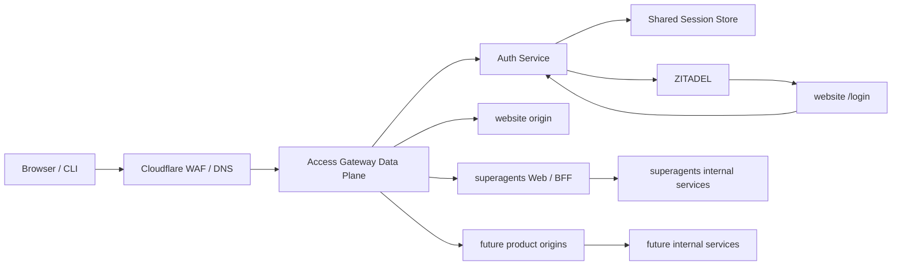

# 拾光统一身份与访问网关架构设计

> 状态：核心登录链路已实现，NAS 部署进行中
>
> 评审日期：2026-07-26
>
> 身份提供方：ZITADEL（`https://sso.shiguanglab.com`）

## 1. 结论

采用以下目标架构：

- ZITADEL 作为唯一权威身份提供方（IdP/IAM）。
- 新建组织级 Identity-Aware Gateway（下文简称 Access Gateway），作为所有第一方 Web 产品的统一公网入口。
- 新建独立 Auth Service，负责 ZITADEL Session API、第三方 OIDC Client、统一会话、登录回调、登出、身份断言和会话撤销；不复用任何产品 BFF。
- 自定义登录界面作为 website 的 `/login` 路由页面交付；页面只负责交互，Auth Service 通过 ZITADEL Session API 完成认证。
- 第一方 Web 产品共享一个父域不透明会话 Cookie，以实现产品间无跳转复用登录。
- ZITADEL Token 仍按 Client、Audience 和 Scope 签发，不在产品间共享。Access Gateway 为每个目标产品签发短时、限定 Audience 的内部身份断言。
- Gateway 只做认证、通用安全控制和粗粒度路由授权；产品服务继续负责工作区、项目、工单等业务资源授权。

整体方向合理，但“共享父域 Cookie”是一个带严格前置条件的例外决策，而不是通用安全最佳实践。只有满足第 6 节的全部安全约束后，本方案才可上线。

## 2. 背景与现状

当前公网链路为：

```text
Cloudflare
  -> Seoul HAProxy / Caddy
      -> NAS ZITADEL :8080
      -> NAS website :3400
      -> NAS superagents Web :3500
          -> superagents BFF :3100
```

已确认的系统边界：

- `superagents` BFF 当前拥有该产品自己的登录和 Session Cookie。
- `superagents/apps/gateway` 是内部机器间调用网关，使用服务 Token，不是用户访问网关。
- website 是 React/Vite 静态站，认证必须由其前置基础设施执行。
- 多个后续产品需要复用统一身份，因此不能由某个产品 BFF 承担组织级认证入口。

## 3. 目标与非目标

### 3.1 目标

- 用户登录一次后，可直接访问所有受信第一方产品，不再逐个产品完成登录跳转。
- 浏览器不持有 ZITADEL Access Token 或 Refresh Token。
- 每个产品获得可验证、Audience 隔离的用户身份。
- 第一方 Web、标准 OIDC 应用、CLI 和服务间调用使用适合各自场景的凭据。
- 用户禁用、主动登出和管理员撤销能及时影响所有产品。
- 任一产品不能伪造其他用户身份，也不能把自己的 Token 用于其他产品。
- website 的公开页面、静态资源和下载内容继续匿名访问并正常缓存。

### 3.2 非目标

- Gateway 不实现工作区、项目、工单、Issue 等业务资源授权。
- Gateway 不成为业务 API 聚合层，不编排产品业务。
- 不把 ZITADEL 的所有用户属性和角色复制到每个请求。
- 不让所有应用共用一个 Access Token。
- 不让浏览器直接访问内部服务，也不把父域 Session Cookie 转发给产品源站。

## 4. 总体架构



推荐实现形态：

| 能力 | 推荐组件 |
|---|---|
| L7 数据平面 | Go 构建的 Caddy 2，使用 `forward_auth` |
| 认证服务 | 独立 Go Auth Service，使用 Chi HTTP API |
| 策略 | Caddy 显式主机/路径策略；复杂度增长后再引入独立策略引擎 |
| 会话 | Redis AOF，保存 AES-256-GCM 加密的 Session |
| 签名密钥 | 当前为 NAS 0600 RSA 私钥；后续迁移 KMS/Vault |
| 身份源 | 现有自托管 ZITADEL |
| 可观测性 | OpenTelemetry、结构化审计日志、指标和告警 |

Caddy Access Gateway 和 Auth Service 是组织级基础设施，应建立独立代码库、部署单元、发布流程和运维责任，不能放入 `superagents` 产品部署中。

Custom Login UI 不再是独立运行服务。其 React 页面放在 website 仓库，由 website 静态服务交付；所有需要机器凭据的登录操作仍由独立 Auth Service 执行。因此当前核心新增运行服务为三个：Access Gateway、Auth Service 和 Redis。独立策略引擎、Vault/KMS 与 OpenTelemetry 随复杂度和运维成熟度演进。

## 5. 域名与应用注册

### 5.1 域名职责

| 域名 | 职责 |
|---|---|
| `sso.shiguanglab.com` | 唯一 OIDC Issuer、ZITADEL API、Discovery、Token、JWKS 和管理界面 |
| `shiguanglab.com` | 官网和 `/login` 登录页面；公开页面匿名放行，受保护路径经 Gateway 鉴权 |
| `opc.shiguanglab.com` | superagents 产品入口 |
| 未来产品子域 | 必须先登记到 Gateway，禁止直接指向源站 |

`sso.shiguanglab.com` 保持唯一、稳定的 Issuer，OIDC 标准端点继续反向代理到 ZITADEL。第一方账号密码登录不发起 Authorization Request，也不依赖 ZITADEL Custom Login URI。浏览器直接打开：

```text
https://shiguanglab.com/login?return_to=/app/sichen
```

页面通过同源 Gateway 路由向 Auth Service 创建短时登录事务并提交凭据。Auth Service 使用 ZITADEL Session API 验证用户，成功后直接创建拾光服务端 Session 和父域不透明 Cookie，再返回服务端保存并校验过的 `return_to`。密码登录过程中没有 `authRequest`、authorization code、Token Exchange 或 OIDC callback。

微信、GitHub、钉钉、企业 OIDC/SAML 等外部身份源仍走独立的 Authorization Code + PKCE 流程。它们可以发生浏览器跳转，但不得复用密码登录接口，也不得把第三方 Token 暴露给第一方产品。

### 5.2 ZITADEL 应用模型

| 应用类型 | 注册方式 |
|---|---|
| 第一方 Web 产品 | Access Gateway 作为一个 Confidential Web Client；产品本身不各自持有浏览器 Token |
| 独立第三方/SaaS 应用 | 每个应用注册独立 OIDC/SAML Client，使用自己的 Redirect URI |
| 对外 API | 每个 API 注册独立 Resource Server/Audience |
| CLI/原生客户端 | 每个客户端独立 Public Client，Authorization Code + PKCE |
| 服务间调用 | ZITADEL Service Account、Client Credentials 或 Private Key JWT |

推荐的 Gateway OIDC Client：

```text
name: Unified Web Session
type: confidential web
redirect_uri: https://shiguanglab.com/api/auth/oidc/callback
post_logout_redirect_uri: https://shiguanglab.com/
flow: authorization_code
pkce: S256
scopes: openid profile email
```

Redirect URI 必须精确登记。`return_to` 不能直接作为任意 URL 使用，只能引用 Auth Service `ALLOWED_RETURN_ORIGINS` 中登记过的第一方产品 Origin 和路径；该值在登录事务创建时规范化并保存到服务端。

从旧 `/_auth/*` 路由升级时，必须同步把现有 ZITADEL OIDC Application 的 Redirect URI 更新为 `https://shiguanglab.com/api/auth/oidc/callback`；不能只修改前端或 Gateway。

## 6. 共享父域 Cookie 决策

### 6.1 决策

第一方 Web 产品共享以下 Cookie：

```http
Set-Cookie: __Secure-sg_session=<opaque-random-id>;
  Domain=shiguanglab.com;
  Path=/;
  Secure;
  HttpOnly;
  SameSite=Lax
```

说明：

- `Domain` 的前导点没有实际意义，因此使用 `shiguanglab.com`，不写 `.shiguanglab.com`。
- 使用 `__Secure-` 前缀。共享域 Cookie 不能使用更安全的 `__Host-` 前缀，因为 `__Host-` 禁止设置 `Domain`。
- Cookie 只保存至少 256 bit 熵的不透明随机 Session ID，不保存 JWT、用户资料、角色、ZITADEL Token 或权限。
- 服务端 Session 保存 `sub`、`sid`、`auth_time`、`amr/acr`、Token 引用、创建时间、最后活动时间、绝对过期时间和撤销状态。

### 6.2 必须满足的上线条件

共享父域 Cookie 会被浏览器发送给 `shiguanglab.com` 的所有子域，因此必须同时满足：

1. 所有 `shiguanglab.com` 子域均纳入资产清单，不存在遗忘 DNS、可接管 CNAME、第三方托管页面或不受信应用。
2. 所有子域流量先到 Access Gateway；源站不允许公网或其他非受信网络直接访问。
3. Gateway 在转发前删除 `__Secure-sg_session`，产品、ZITADEL、website 静态服务、Umami 等源站永远看不到该 Cookie。
4. 仅允许 Auth Service 的固定登录、续期和登出端点设置或清除该 Cookie；Gateway 过滤其他所有源站响应中的同名 `Set-Cookie`。
5. Gateway 拒绝同名重复 Cookie，避免 Cookie tossing 和解析差异。
6. 所有子域强制 HTTPS，并启用 `Strict-Transport-Security: max-age=31536000; includeSubDomains`；确认没有 HTTP 子域后再考虑 `preload`。
7. 所有状态变更请求执行产品级 `Origin` Allowlist 和 CSRF Token 校验。`SameSite` 不能防御同一父域下恶意子域发起的 same-site 请求。
8. CORS 默认拒绝，禁止 `Access-Control-Allow-Origin: *` 与凭据组合使用。
9. 产品页面使用严格 CSP，第三方脚本纳入供应链审查。
10. Session 在登录、提权、敏感资料变更后轮换；支持空闲过期、绝对过期、即时撤销和并发会话限制。

任一条件无法满足时，必须退回“每产品 Host-only Cookie + ZITADEL SSO 静默跳转”模型。

### 6.3 当前阻断项

当前 `analytics.shiguanglab.com` 直接由 Seoul Caddy 回源 NAS Umami。父域 Cookie 上线后，浏览器会把统一 Session 发送到该域。

上线前必须二选一：

- 将 Analytics 全量纳入 Access Gateway，并在请求和响应两个方向隔离统一 Cookie。
- 将采集和管理端迁到另一个可注册域，彻底离开 `shiguanglab.com` Cookie 范围。

同样规则适用于 `sso.shiguanglab.com`、`www.shiguanglab.com` 及未来任何子域。仅在源站前“再加一层 Nginx”不足以解决问题，Cookie 必须在最前面的可信 Gateway 被剥离。

## 7. Token 与身份模型

### 7.1 三类凭据

| 凭据 | 签发者 | 使用者 | Audience | 是否进入浏览器 |
|---|---|---|---|---|
| 统一 Session Cookie | Auth Service | Access Gateway | 统一 Web Session | 是，仅不透明 ID |
| ZITADEL Token | ZITADEL | Gateway、独立 OIDC 应用、API Client | 对应 Client/API | 第一方 Web 不进入 |
| 内部身份断言 JWT | Auth Service | 指定产品源站 | 单一产品 | 否 |

统一登录共享的是身份会话，不是 Access Token。ZITADEL Token 按应用和 Audience 签发是正确且必要的隔离机制。

### 7.2 内部身份断言

Gateway 对每次已认证请求签发 30 至 120 秒有效的 JWT，并放入单一可信头。JWT Header 必须使用专用 `typ: sg-identity+jwt`，避免被误当成 ZITADEL Access Token 或 ID Token：

```http
X-SG-Identity: eyJ...
X-SG-Request-ID: 01...
```

示例 Claims：

```json
{
  "iss": "https://shiguanglab.com",
  "aud": "superagents-bff",
  "sub": "zitadel-user-id",
  "sid": "gateway-session-id",
  "azp": "shiguang-access-gateway",
  "org_id": "zitadel-org-id",
  "entitlements": ["superagents:access"],
  "roles": ["platform_user"],
  "auth_time": 1785000000,
  "amr": ["pwd", "mfa"],
  "jti": "unique-assertion-id",
  "iat": 1785000100,
  "nbf": 1785000095,
  "exp": 1785000160
}
```

规则：

- 使用非对称签名和 `kid`，建议 RS256 以获得广泛库兼容性。
- 公钥通过 `https://shiguanglab.com/.well-known/sg-identity-jwks.json` 发布并支持轮换。
- 每个产品只接受自己的 `aud`。
- 产品必须校验签名、`typ`、`iss`、`aud`、`exp`、`nbf`，并限制允许的算法。
- `email`、`name` 等资料不是稳定主键；产品用户映射始终使用 ZITADEL `sub`。
- 普通 `X-User-ID`、`X-Role` 等明文 Header 只能用于日志便利，不能作为授权依据。
- Gateway 必须先删除外部请求中的 `X-SG-*`、`X-User-*` 和其他身份头，再注入可信值。

### 7.3 API 和服务调用

- 浏览器访问第一方产品：Cookie -> Gateway -> 产品专属内部身份断言。
- CLI 或第三方 Client：使用自己的 ZITADEL Client 获取 Access Token，Token 的 Audience 必须是目标 API。
- 产品到产品的机器调用：使用服务身份 Token，不复用用户 Cookie。
- 代表用户进行下游调用：使用短时、目标 Audience 限定的委托断言；需要标准 OAuth 委托时使用 ZITADEL Token Exchange。
- 不允许把某个产品的 Bearer Token 原样扩散到所有下游服务。

ZITADEL Token Exchange 只能缩小已有 Token 的 Audience 集合，不能凭空增加目标 Audience；因此应用注册和初始 Audience 必须预先设计。

## 8. 核心流程

### 8.1 第一方账号密码登录

```mermaid
sequenceDiagram
    participant B as Browser
    participant G as Access Gateway
    participant A as Auth Service
    participant Z as ZITADEL
    participant L as website /login

    B->>G: GET protected resource
    G->>A: forward_auth check
    A-->>B: 302 /login?return_to=/protected/path
    B->>L: immediately render usable login form
    L->>A: POST /api/auth/login/context with return_to
    A->>A: normalize return_to; save opaque transaction + CSRF (10 min)
    A-->>L: transactionId + csrfToken; set HttpOnly CSRF cookie
    L->>A: POST loginName + password + transactionId + csrfToken
    A->>Z: POST /v2/sessions with user/password checks
    Z-->>A: ZITADEL session ID/token + user factor
    A->>A: create encrypted server-side Shiguang Session
    A-->>B: Set parent-domain opaque Session Cookie
    A-->>L: validated server-side redirect target
    L-->>B: navigate to original protected path
```

登录事务和 CSRF Token 必须服务端加密保存、一次性使用并在 10 分钟内过期。`return_to` 在创建事务时完成校验并保存，密码提交请求不能覆盖它。密码只存在于当前 HTTPS 请求体和 ZITADEL Session API 调用中，不进入 URL、浏览器存储、Redis、日志或 Trace。

### 8.2 外部身份提供方登录

外部身份提供方从 `/api/auth/federated/start?provider=...&return_to=...` 开始，使用 `state`、`nonce` 和 PKCE。Auth Service 只接受服务端 `OIDC_PROVIDER_IDS` 中配置的 provider，并通过 ZITADEL 的 `urn:zitadel:iam:org:idp:id:<id>` scope 直达对应身份源。Auth Service 完成 code exchange 和 ID Token 校验后创建同一种拾光服务端 Session。该流程允许跳转到 ZITADEL 和外部身份源，但与账号密码 Session API 流程相互独立。

### 8.3 已登录访问其他产品

```text
Browser -> opc.shiguanglab.com with __Secure-sg_session
Gateway -> validate server-side session
Gateway -> evaluate product/route policy
Gateway -> remove Cookie and untrusted identity headers
Gateway -> mint aud=superagents-bff identity assertion
Gateway -> superagents origin
```

由于 Cookie 已覆盖父域，浏览器访问另一个受信产品时不需要再次跳转到登录页。

### 8.4 website 路由

建议初始策略：

| 路径 | 策略 |
|---|---|
| `/`、公开内容页 | Anonymous |
| `/assets/*`、`/downloads/*`、SEO 文件 | Anonymous，剥离 Cookie，允许 CDN Cache |
| `/login`、`/login/*` | Anonymous，登录专用 CSP，禁止统计与第三方脚本 |
| `/api/auth/login/*` | Anonymous，仅允许 `https://shiguanglab.com` Origin，校验登录事务与 CSRF，转发到 Auth Service 并限流 |
| `/app/*` | Authenticated，按产品登记的 Entitlement 授权 |
| `/account/*`、`/settings/*` | Authenticated |
| 未登记敏感路径 | 默认拒绝 |

匿名路径即使携带统一 Cookie，也应在缓存键计算和回源前删除 Cookie，避免降低缓存命中率或把会话带到静态源站。

### 8.5 登出与撤销

用户主动登出：

1. 浏览器以 `POST` 调用 `https://shiguanglab.com/api/auth/logout`，校验 Origin。
2. Auth Service 撤销服务端 Session，并清除父域 Cookie。
3. 浏览器跳转 ZITADEL `end_session_endpoint`。
4. ZITADEL 结束 SSO Session，并跳回已登记的 `post_logout_redirect_uri`。

ZITADEL 管理员撤销、其他应用登出或会话终止：

1. ZITADEL 向 Gateway Client 的 `backchannel_logout_uri` 发送 Logout Token。
2. Auth Service 校验 Logout Token 的签名、Issuer、Audience、`events`、`sid/sub`、过期时间和 `jti`。
3. 按 `sid` 撤销对应统一 Session，必要时按 `sub` 撤销该用户全部 Session。

产品不维护独立登录 Session 时无需逐个产品清理。若某产品仍保留本地 Session，必须订阅统一撤销事件或自行实现 Back-Channel Logout。

## 9. Gateway 能力边界

### 9.1 必须承担

- TLS 入口、反向代理、服务发现、健康检查和超时。
- OIDC 登录拦截、Callback、Logout 和统一 Session 校验。
- Cookie 请求/响应隔离。
- 外部 Bearer Token 校验或按路由交给标准 Resource Server。
- 产品/路由级认证要求、Entitlement、Scope、全局角色和认证强度检查。
- CSRF、CORS、Origin/Referer 校验、安全响应头。
- 外部身份 Header 清洗和内部身份断言注入。
- HTTP、WebSocket、SSE 和 gRPC 建连鉴权。
- 限流、请求大小限制、WAF 联动和基础防滥用。
- 审计、Trace ID、认证指标和安全告警。
- 源站 mTLS、网络 Allowlist 和防绕过。

### 9.2 不应承担

- 产品业务聚合和响应拼装。
- 工作区、项目、Issue、工单等资源级授权。
- 产品数据库查询和业务事务。
- 长时间缓存会影响授权正确性的业务权限。
- 代替产品进行字段级数据脱敏。
- 把所有内部服务直接暴露为公网路由。

粗细授权边界：

```text
Gateway: 此用户能否进入 superagents，能否调用 admin 路由
Product: 此用户能否编辑 workspace A 的 issue B
```

## 10. 产品接入契约

每个产品登记以下配置：

```yaml
product_id: superagents
hosts:
  - opc.shiguanglab.com
origin: https://superagents.internal
identity_audience: superagents-bff
public_routes:
  - GET /health
protected_routes:
  - path: /**
    required_entitlements:
      - superagents:access
allowed_browser_origins:
  - https://opc.shiguanglab.com
protocols:
  - http
  - websocket
```

产品必须：

- 只接受 Gateway 私网或 mTLS 连接。
- 验证 `X-SG-Identity` JWT，不信任明文身份头。
- 使用 `sub` 建立本地用户映射。
- 在业务层执行资源级授权。
- 不读取统一 Session Cookie，不持有 ZITADEL Refresh Token。
- 对 WebSocket 在握手时鉴权，并在长连接超过授权窗口后重新验证或断开。
- 将 `X-SG-Request-ID` 写入日志和下游调用，便于审计追踪。

## 11. website Login 页面

Login 页面作为 website 的 `/login` 路由开发，但应使用独立、懒加载的页面入口，不加载首页业务代码和微前端。当前 website 的 `index.html` 全局加载 Umami，因此实施时必须选择以下一种方式：

- 将 Umami 改为由 React 按路由加载，并在 `/login` 完全禁用。
- 为 `/login` 构建独立 `login.html` 入口，由 Gateway 将 `/login` 和 `/login/*` 重写到该入口。

不能让登录页面继续加载 `analytics.shiguanglab.com/script.js` 或其他非认证必需的第三方脚本。Gateway 应为 `/login` 返回独立的严格 CSP，并禁止被其他页面嵌入。

页面可参考 ZITADEL 官方 `zitadel-login` 的状态和交互设计，但认证状态机位于 Auth Service。完整能力至少覆盖：

- 用户名/密码。
- Passkey。
- MFA 和认证强度升级。
- 外部身份提供方。
- 密码找回、账号锁定和错误频率限制。
- 邮箱验证、首次登录和必要的条款确认。
- Session 选择和 Logout。
- 国际化、无障碍和移动端。

安全要求：

- 用户凭据由 `/login` 页面通过同源 `/api/auth/login/*` 路由提交给 Auth Service，不发送到 website 静态源站。
- 账号密码登录由 Auth Service 通过 ZITADEL Session API 创建 Session，随后直接签发拾光不透明会话；不创建或 Finalize Auth Request。
- ZITADEL Session API 的机器凭据只保存在 Auth Service，并遵循最小权限。
- Login 页面不签发 Token、不保存产品 Session、不接受任意 Callback，也不把密码写入日志或浏览器存储。
- OIDC Endpoint、Token Endpoint、Discovery、JWKS、Introspection 和 End Session 仍由 `sso.shiguanglab.com` 代理到 ZITADEL。
- 认证页和 Token 响应禁止缓存；启用严格 CSP、Frame Ancestors 和速率限制。

## 12. 安全与可用性基线

### 12.1 会话

- 不透明随机 Session ID，服务端存储，数据库中保存 ID 的哈希。
- 建议空闲过期 12 小时、绝对过期 7 天；高风险环境按策略缩短。
- 管理操作要求较新的 `auth_time` 或 MFA，触发 Step-up Authentication。
- 每次登录和提权后轮换 Session ID。
- Refresh Token 如确需保存，必须加密，且不能写日志、Trace 或错误响应。

### 12.2 源站保护

- Cloudflare 只连接受信 Gateway 地址。
- Gateway 到源站使用 mTLS 或 Tailscale ACL，并以网络策略阻止绕过。
- 源站不得在公网端口监听。
- Gateway 信任客户端 IP 头时必须限制上游代理集合，清洗外部伪造的 Forwarded Header。

### 12.3 高可用

Access Gateway、Auth Service、Session Store 和 ZITADEL 都属于 Tier-0：

- Gateway 和 Auth Service 至少两个无状态实例，滚动升级。
- Session Store 具备主从、持久化、备份和故障切换。
- 签名密钥至少保留当前与上一版本，按 `kid` 平滑轮换。
- ZITADEL PostgreSQL 定期备份并执行恢复演练。
- 保护路由在 Auth Service 不可用时 Fail Closed；仅显式 Anonymous 路由允许继续服务。
- 对 Login 成功率、Callback 错误、Session 校验延迟、撤销延迟、401/403 激增和 JWKS 失败告警。

当前 Seoul 单节点 HAProxy/Caddy 和 NAS 单实例回源是现状，不是最终高可用目标。目标部署应允许至少同地域双实例，并规划跨地域灾备。

## 13. 审计事件

至少记录：

- `login_started`、`login_succeeded`、`login_failed`
- `session_created`、`session_rotated`、`session_expired`、`session_revoked`
- `logout_started`、`backchannel_logout_received`
- `access_allowed`、`access_denied`
- `token_validation_failed`、`identity_assertion_issued`
- `csrf_rejected`、`origin_rejected`、`header_spoof_rejected`
- `policy_changed`、`product_registered`、`key_rotated`

日志中不得包含 Session Cookie、Authorization Code、Access Token、Refresh Token、密码或完整身份断言。审计记录使用 `sub`、产品 ID、Route ID、决策、策略版本、Request ID 和必要的风险信息。

## 14. 实施顺序

### Phase 0：资产与风险收敛

- 建立全部 `shiguanglab.com` DNS、CNAME、证书和源站清单。
- 清理悬空 DNS 和第三方托管子域。
- 决定 Analytics 迁移或 Gateway 隔离方案。
- 禁止产品源站公网直连，建立 mTLS/Tailscale ACL。

### Phase 1：身份基础设施

- 在 ZITADEL 创建 Gateway Web Client、API Applications、服务账号和 Back-Channel Logout。
- 在 website 增加 `/login` 专用页面入口，禁用 Umami 和第三方脚本；保持 `sso.shiguanglab.com` Issuer 不变。
- 部署 Auth Service、Session Store、JWKS 和密钥轮换。

### Phase 2：Gateway

- 部署 Caddy Access Gateway + `forward_auth`。
- 完成 Cookie 双向过滤、OIDC Callback、CSRF、Origin、CORS 和审计。
- 接入 website，先保持公开路径匿名。

### Phase 3：产品接入

- 接入 `opc.shiguanglab.com`。
- superagents BFF 改为验证内部身份断言，并逐步删除本地账号密码登录和产品 Session。
- 验证 HTTP、WebSocket、下载、微前端和长连接行为。

### Phase 4：推广与加固

- 建立产品接入模板、SDK、JWKS 缓存和契约测试。
- 接入后续第一方产品。
- 完成故障切换、密钥轮换、Session 撤销和恢复演练。

## 15. 上线验收

- 用户首次登录后，访问 website 受保护路径和 `opc.shiguanglab.com` 均不再发生登录跳转。
- 浏览器存储中不存在 ZITADEL Access Token 或 Refresh Token。
- `aud=superagents-bff` 的身份断言不能访问其他产品。
- 外部伪造 `X-SG-Identity` 被 Gateway 清除。
- 产品源站直连失败。
- `analytics`、ZITADEL、website 静态源站和产品源站均收不到统一 Session Cookie。
- 任一子域不能通过响应覆盖统一 Session Cookie。
- 跨子域 CSRF 测试失败，合法产品请求成功。
- ZITADEL Back-Channel Logout 后，统一 Session 在目标 SLA 内失效。
- Session 密钥轮换期间新旧请求均按预期处理，旧密钥退出后旧断言失效。
- Auth Service 故障时保护路由 Fail Closed，公开官网仍可按明确策略服务。
- 所有登录、拒绝、撤销和策略变更可通过 Request ID 追踪。

## 16. 关键架构决策

| 决策 | 选择 | 理由 |
|---|---|---|
| 身份源 | ZITADEL | 保留标准 OIDC/OAuth、MFA、Passkey、用户与组织管理 |
| 统一入口 | 独立 Access Gateway | 避免产品 BFF 成为组织级基础设施 |
| 第一方 Web 会话 | 父域不透明 Cookie | 满足产品间零跳转体验；以严格子域治理换取体验 |
| 浏览器 Token | 不暴露 | 降低 XSS 导致 Token 外泄的影响 |
| 产品身份透传 | 短时 Audience 限定 JWT | 可验证、可轮换、产品隔离 |
| 产品授权 | 产品内完成 | 保持业务数据和授权规则的领域归属 |
| 第三方应用 | 独立 OIDC/SAML Client | 保持标准兼容和 Client/Audience 隔离 |
| 登出 | RP-Initiated + Back-Channel Logout | 同时覆盖浏览器主动登出和服务端会话撤销 |

## 17. 参考资料

- [ZITADEL：Custom Login UI 的 OIDC 标准流程](https://zitadel.com/docs/guides/integrate/login-ui/oidc-standard)
- [ZITADEL：Reverse Proxy 与 Login UI 路由](https://zitadel.com/docs/self-hosting/manage/reverseproxy/reverse_proxy)
- [ZITADEL：Back-Channel Logout](https://zitadel.com/docs/guides/integrate/back-channel-logout)
- [ZITADEL：Token Introspection](https://zitadel.com/docs/guides/integrate/token-introspection)
- [ZITADEL：OAuth 2.0 Token Exchange](https://zitadel.com/docs/guides/integrate/token-exchange)
- [IETF RFC 9700：OAuth 2.0 Security Best Current Practice](https://datatracker.ietf.org/doc/html/rfc9700)
- [IETF：OAuth 2.0 for Browser-Based Applications](https://datatracker.ietf.org/doc/draft-ietf-oauth-browser-based-apps/26/)
- [OWASP：Session Management Cheat Sheet](https://cheatsheetseries.owasp.org/cheatsheets/Session_Management_Cheat_Sheet.html)
- [MDN：Set-Cookie 与 Cookie Prefix](https://developer.mozilla.org/en-US/docs/Web/HTTP/Reference/Headers/Set-Cookie)
